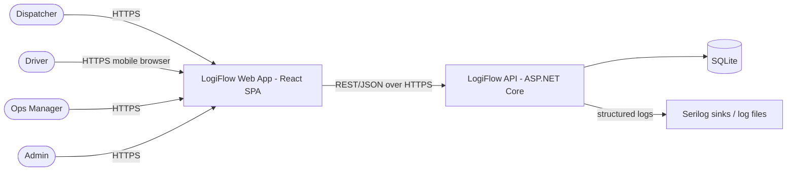
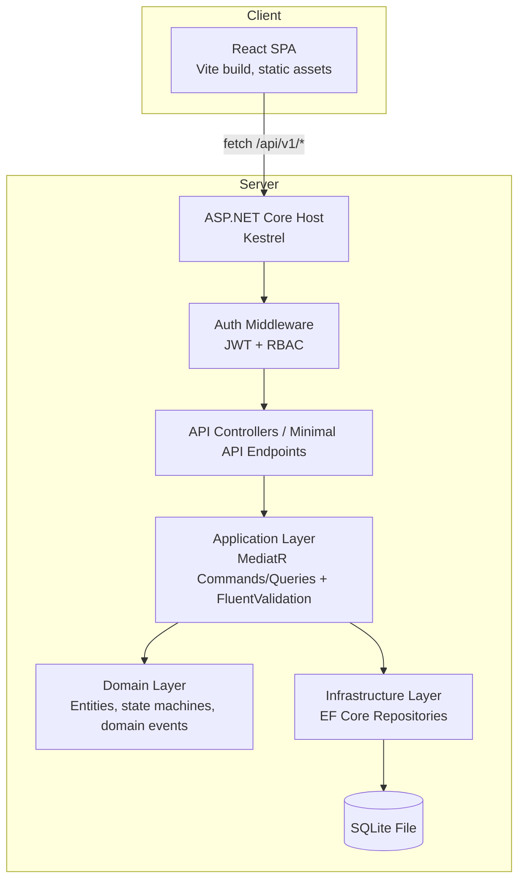
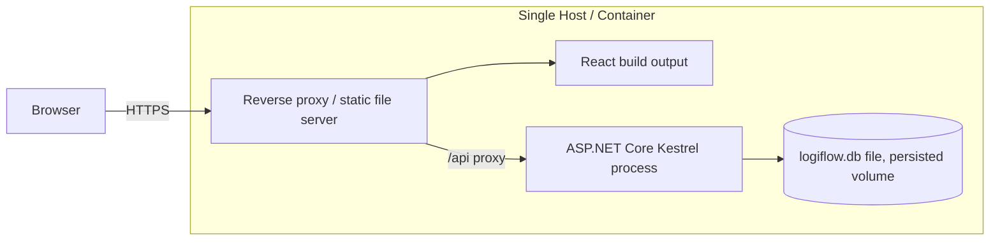

# High-Level Design (HLD) — LogiFlow

**Version:** 1.0 | **Date:** 2026-09-18 | **Status:** Draft for approval
**Derived from:** `12-PRD.md`, `11-BRD.md`. Detailed conventions in `02-tech-stack-and-structure.md`,
`04-database-schema.md`, `05-api-contract-standards.md`.

## 1. Architecture Style

Layered/Clean architecture on the backend (Domain → Application → Infrastructure → API), a
component-based SPA frontend, contract-first integration via OpenAPI, single-node deployment for
v1 (SQLite, no distributed state). CQRS pattern within the Application layer (commands/queries via
MediatR) to keep read and write paths explicit and testable.

## 2. System Context



## 3. Container View



## 4. Component Breakdown

### 4.1 Frontend components (React)
| Component area | Responsibility |
|---|---|
| `features/shipments` | List, create, edit, cancel, status transitions, audit view |
| `features/routes` | Route creation, vehicle/driver assignment, shipment-to-route assignment |
| `features/planning-board` | Kanban + list views combining shipments and routes |
| `features/driver-view` | Scoped "My Routes" view for Driver role |
| `features/dashboard` | Aggregated counts, SLA-risk widget, utilization snapshot |
| `features/master-data` | Warehouses, vehicles, drivers CRUD screens (Admin) |
| `features/auth` | Login, token storage/refresh, role-aware route guards |
| `api/` | Generated typed client from `contracts/v1-openapi.yaml` |
| `components/` | Shared UI: tables, forms, status badges, toast notifications |

### 4.2 Backend components (ASP.NET Core)
| Layer | Contents |
|---|---|
| **Api** | Controllers/endpoints per resource, DTOs, auth attributes, global exception → Problem Details middleware |
| **Application** | Commands (`CreateShipmentCommand`, `AssignShipmentToRouteCommand`, ...), Queries (`GetShipmentsQuery`, ...), Validators, MediatR pipeline behaviors (validation, logging) |
| **Domain** | Entities (`Shipment`, `Route`, `Vehicle`, `Driver`, `Warehouse`), value objects, `Shipment.TransitionTo()` state machine enforcing BR-7, domain events (`ShipmentStatusChangedEvent`) |
| **Infrastructure** | `LogiFlowDbContext` (EF Core + SQLite), repository implementations, migrations, seed data |

## 5. Key Design Decisions (summary — full rationale as ADRs in `/docs/adr/`)

| Decision | Choice | Rationale |
|---|---|---|
| API style | REST, resource-oriented, contract-first OpenAPI | Simpler for a CRUD-heavy domain than GraphQL; easier contract testing |
| State machine enforcement | In Domain entity (`Shipment.TransitionTo`), not in controller/service | Keeps BR-7 rules in one place, testable in isolation, reusable across API and future background jobs |
| Capacity/overlap checks (BR-3–5) | Enforced in Application layer command handlers, backed by DB queries, not just UI validation | Server is the authority; UI validation is a UX convenience only |
| Auth | ASP.NET Core Identity + JWT bearer tokens, role claims | Standard, well-supported, avoids building custom auth |
| DB | SQLite for v1 | Matches BRD's constraint (§7) on expected volume; documented migration path to PostgreSQL if exceeded |
| Frontend state | TanStack Query (server state) + Zustand (UI state) | Avoids manual cache/loading-state bugs; clear separation of concerns |

## 6. Data Flow Example — Create & Assign Shipment (F5, F9, F10)

```mermaid
sequenceDiagram
    participant U as Dispatcher (SPA)
    participant API as API (Controller)
    participant APP as Application (Handler)
    participant DOM as Domain (Shipment)
    participant DB as SQLite

    U->>API: POST /shipments {origin, destination, weightKg, priority}
    API->>APP: CreateShipmentCommand
    APP->>APP: Validate (FluentValidation)
    APP->>DOM: Shipment.Create(...) -> computes SLA due date (BR-1)
    DOM-->>APP: Shipment (status=Pending)
    APP->>DB: Insert shipment + status_history(Pending)
    DB-->>APP: OK
    APP-->>API: ShipmentResponse
    API-->>U: 201 Created

    U->>API: POST /routes/{id}/shipments {shipmentId}
    API->>APP: AssignShipmentToRouteCommand
    APP->>DB: Load route, vehicle capacity, current assigned weight
    APP->>APP: Check capacity (BR-5)
    alt capacity ok
        APP->>DOM: Shipment.TransitionTo(Assigned)
        APP->>DB: Update shipment.route_id, status; insert status_history(Assigned)
        APP-->>API: 200 OK
    else over capacity
        APP-->>API: 400 Problem Details (capacity exceeded)
    end
    API-->>U: response
```

## 7. Security Design

- **AuthN:** JWT bearer tokens issued by `/auth/login`, short-lived access token + refresh token.
- **AuthZ:** Role claims checked via ASP.NET Core policies mapped from `x-roles` in the OpenAPI
  contract (`05-api-contract-standards.md`); Driver-role additionally scoped to "own assigned
  routes only" via a resource-ownership check in the Application layer, not just role check.
- **Input validation:** FluentValidation server-side on every command, independent of client-side
  Zod validation (defense in depth).
- **Data protection:** Passwords hashed via ASP.NET Identity defaults (PBKDF2); HTTPS enforced;
  no PII beyond names/phone numbers/addresses stored, retention policy documented in BRD-driven
  future data-governance ADR if required.
- **Audit:** `shipment_status_history` is append-only from the application's perspective — no
  update/delete endpoint exposed for it.

## 8. Deployment View (v1)



- v1 is a single deployable unit: reverse proxy (Nginx or Caddy) serves the built SPA and proxies
  `/api/*` to the Kestrel process; SQLite file lives on a persisted volume/disk.
- Backups: scheduled copy of the SQLite file (application briefly quiesced or using SQLite's
  online backup API) to external storage; documented in DevOps Agent's runbook.
- Migration path (documented, not built in v1): swap SQLite provider for Npgsql/PostgreSQL in
  Infrastructure layer only — Domain/Application layers are DB-agnostic by design (§4.2).

## 9. Cross-Cutting Concerns

| Concern | Approach |
|---|---|
| Logging | Serilog, structured, correlation ID per request, written to file/console (DevOps decides sink) |
| Error handling | Global exception middleware → RFC7807 Problem Details (`05-api-contract-standards.md`) |
| Pagination | Standard envelope on all list endpoints (`05-api-contract-standards.md`) |
| Validation | FluentValidation (backend) mirrored by Zod (frontend) per business rules in BRD §6 |
| Testing | Unit (xUnit/Vitest), contract tests, Playwright E2E per `06-testing-strategy-playwright.md` |
| Time handling | UTC storage, local display, per `02-tech-stack-and-structure.md` |

## 10. Mapping Back to Requirements

Every component/flow above traces to PRD features (F1–F15) and BRD business rules (BR-1–BR-7);
no component exists without a PRD feature driving it, and no BRD business rule is implemented in
more than one place (single-source enforcement, e.g. BR-7 lives only in `Shipment.TransitionTo`).
Implementation agents must not introduce components not traceable to this HLD — changes to the
HLD itself require the same spec-review gate as a feature spec (`03-spec-driven-workflow.md`).
